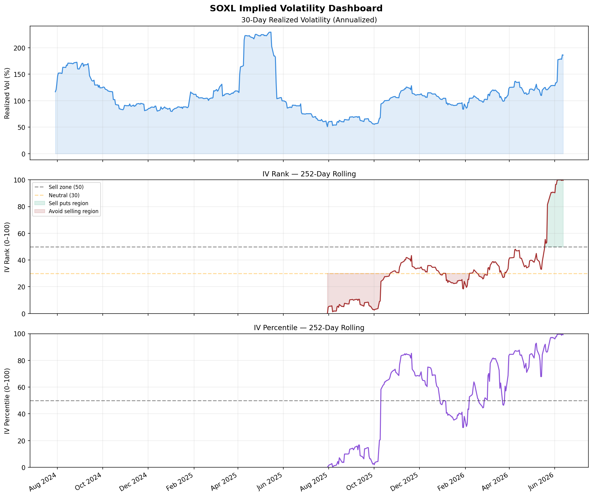
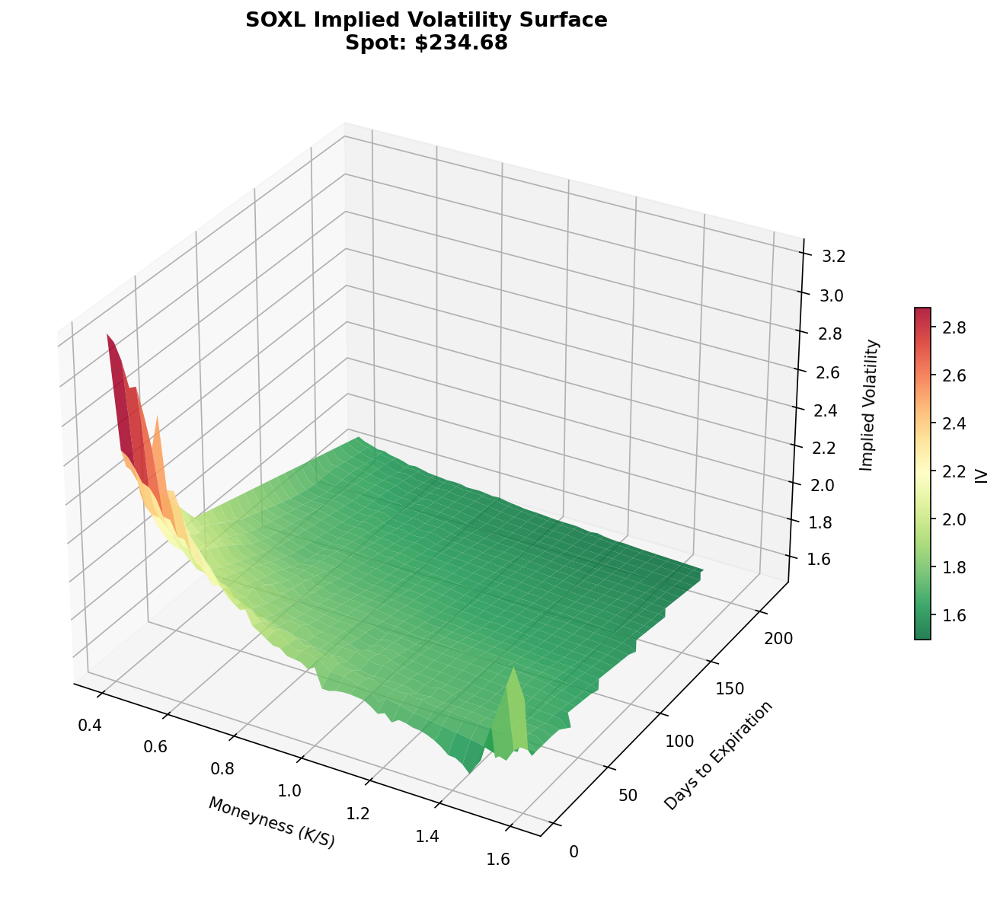
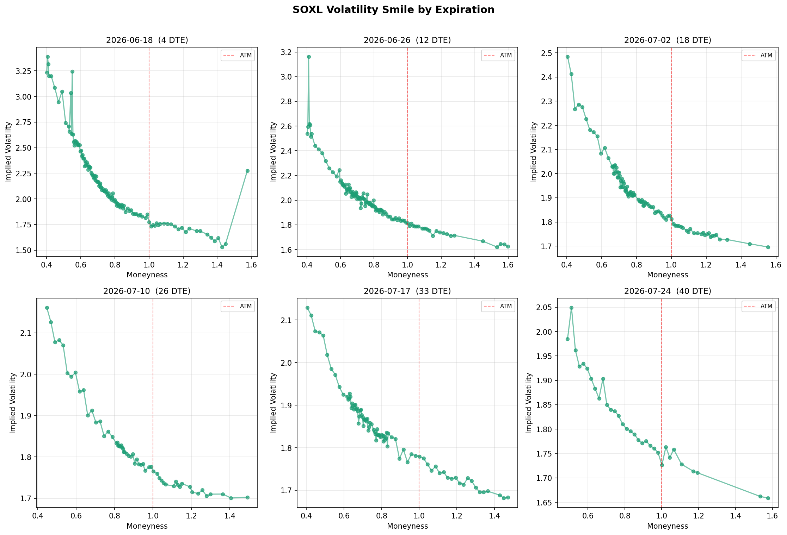
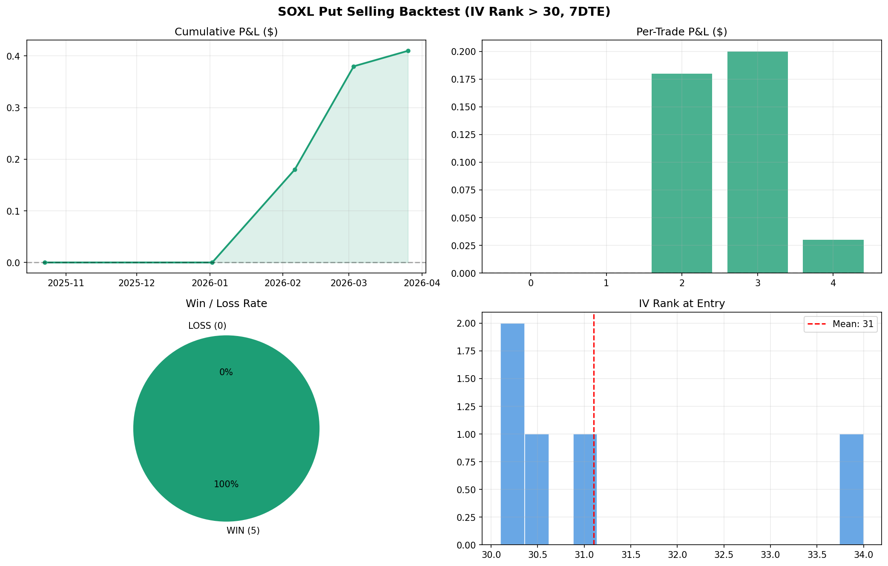

# SOXL Options Analysis & IV Signal

A quantitative options analysis toolkit for **SOXL** (Direxion Daily Semiconductor Bull 3X ETF), built to explore implied volatility structure and generate systematic put-selling signals.

---

## What this does

| Module           | What it produces                                                             |
| ---------------- | ---------------------------------------------------------------------------- |
| `fetch_data.py`  | Live price history + full options chain from Yahoo Finance                   |
| `vol_surface.py` | 3D implied volatility surface (static + interactive) and vol smile charts    |
| `iv_rank.py`     | Rolling IV Rank and IV Percentile — the two core signals for premium sellers |
| `backtest.py`    | In-sample backtest + walk-forward (OOS) validation of "sell 15%-OTM puts when IV Rank ≥ 50" |
| `signal.py`      | Today's go/no-go signal with suggested strike and expiration                 |

---

## Motivation

SOXL is one of the most volatile liquid ETFs in the US market, which makes it interesting for options premium sellers — but only when volatility is *expensive* relative to its own history.

This project builds the infrastructure to answer: **is now a good time to sell puts on SOXL?**

The core insight: implied volatility (IV) mean-reverts. When IV Rank is high (≥50), the market is overpaying for downside protection. Systematic put sellers can collect that fear premium and profit when volatility normalizes.

---

## Outputs

- `data/price_history.png` — 1-year SOXL price chart
- `data/iv_rank_history.png` — Rolling IV Rank + IV Percentile dashboard
- `data/vol_surface_3d.png` — Static 3D vol surface
- `data/vol_surface_interactive.html` — Rotate/zoom vol surface in browser
- `data/vol_smile.png` — Volatility smile per expiration
- `data/backtest_results.png` — Backtest P&L, win rate, trade distribution

---

## Example Outputs

### IV Rank Dashboard



### Volatility Surface



### Volatility Smile



### Backtest Results



## Results So Far

First validated run (2026-06-29), entry threshold IV Rank ≥ 50:

| Metric              | In-sample (naive) | Walk-forward (OOS) |
|---------------------|-------------------|--------------------|
| Trades              | 9                 | 37                 |
| Sharpe              | 765.1             | 6.33               |
| Monte Carlo p-value | n/a               | 0.991              |

The in-sample Sharpe of 765 is **not a real result** — it comes from 9 trades
with a 100% win rate on the same data used to define the rule. Out-of-sample
walk-forward validation produces 37 trades with a Monte Carlo p-value of 0.991
under a random-entry-timing null, meaning the apparent edge is **not
distinguishable from random timing** at the current sample size and premium
model. See `journal/2026-06-29-walkforward-validation.md`.

Honest conclusion: no demonstrated edge yet. Real implied-vol data and 50+
out-of-sample trades are required before any edge claim.

## Quickstart

```
# Clone
git clone https://github.com/asoracca/soxl-vol-surface.git
cd soxl-vol-surface

# Install dependencies
pip install -r requirements.txt

# Run full pipeline
python main.py

# Or run just today's signal
python src/signal.py
```

---

## Signal logic

```
IV Rank ≥ 50  →  SELL PUTS   ✅  (vol in top half of 1Y range)
IV Rank 30–50 →  NEUTRAL     ⚠️  (acceptable but not optimal)
IV Rank < 30  →  AVOID       ❌  (vol cheap, premium thin)
```

**IV Rank** = (Current IV − 52w Low) / (52w High − 52w Low) × 100

---

## Backtest methodology

- **Entry**: IV Rank ≥ 50 (parameterized as `iv_rank_threshold`, default 50,
  matching the live discipline rule in the signal module)
- **IV series**: both `run_backtest` and `walk_forward_backtest` use
  `compute_soxl_scaled_iv` (VIX scaled by the SOXL/SPY realized-vol ratio), so
  in-sample and out-of-sample results are directly comparable
- **Validation**: `main.py` runs walk-forward (train 12mo / test 3mo, rolling),
  a Monte Carlo significance test under a random-entry-timing null, and a
  by-regime stress test — the out-of-sample numbers are the headline result
- **Strike**: 15% out-of-the-money put
- **Expiration**: ~7 DTE
- **Exit**: Hold to expiration
- **Premium estimate**: Simplified Black-Scholes approximation using the scaled IV proxy
- **Note**: This is a signal validation backtest, not a production P&L model. Real fills, commissions, and margin are not included.

---

## Risk warning

SOXL is a **3x leveraged ETF**. Daily rebalancing causes volatility decay, and the ETF can move 20–40% in a single session. Put sellers face significant assignment risk. Size positions conservatively — no more than 1–2% of capital per trade.

---

## Tech stack

- `yfinance` — market data
- `pandas` / `numpy` — data processing
- `scipy` — surface interpolation
- `matplotlib` — static charts
- `plotly` — interactive 3D surface

---

## Project structure

```
soxl-vol-surface/
├── main.py                  ← run everything
├── requirements.txt
├── README.md
├── .gitignore
├── src/
│   ├── fetch_data.py        ← price + options data
│   ├── vol_surface.py       ← 3D surface + smile plots
│   ├── iv_rank.py           ← IV Rank / IV Percentile
│   ├── backtest.py          ← in-sample + walk-forward backtest, MC, stress test
│   └── signal.py            ← today's trade recommendation
├── journal/                 ← forward-test / validation notes
└── data/                    ← generated outputs (gitignored)
```

---

## Known Limitations & Future Work

- **IV proxy:** Uses VIX scaled by the SOXL/SPY realized-vol ratio as a proxy for
SOXL implied volatility. Real IV history requires paid data (CBOE, OptionMetrics).
This distorts premium estimates, especially for deep OTM puts.

- **Backtest sample size:** Only 9 in-sample / 37 out-of-sample trades generated.
Statistically insufficient — 50+ OOS trades needed for meaningful conclusions.

- **No Greeks hedging:** Strategy assumes hold-to-expiration with no delta hedging.
Real implementation would manage delta exposure dynamically.

## Planned upgrades

- Integrate CBOE VIX term structure / real options IV as the premium input
- Add Kelly Criterion position sizing
- Add variance risk premium analysis
- Extend to multi-ticker (QLD, FNGO, NVDA)

---

## Statistical Disclaimer & Limitations

This project is a quantitative research tool built for learning and
exploration. The following limitations are acknowledged explicitly:

### Backtesting caveats

- **Past performance does not guarantee future results.** All backtest
results are hypothetical and subject to look-ahead bias, overfitting,
and regime change risk.
- **In-sample vs out-of-sample:** The naive backtest is in-sample and is
reported only as a baseline (labelled "not tradeable"). Walk-forward
out-of-sample validation, Monte Carlo significance testing, and regime stress
testing are now implemented and run in `main.py`; the out-of-sample figures
are the reported result.
- **Small sample size:** The backtest generates 9 in-sample / 37 out-of-sample
trades. This is statistically insufficient to draw definitive conclusions — a
minimum of 50+ OOS trades is required for meaningful inference.
- **IV proxy limitation:** True implied volatility history requires paid
data (CBOE, OptionMetrics). This project scales VIX by the SOXL/SPY realized-vol
ratio as a proxy, which distorts premium estimates.
- **No transaction cost modeling beyond estimates:** Real fills, margin
requirements, early assignment risk, and liquidity constraints are not
fully modeled.
- **Survivorship bias:** SOXL has survived as an ETF. Strategies tested
on surviving instruments overstate expected returns.

### Strategy risk factors

- SOXL is a 3x leveraged ETF. A 33% drop in semiconductors causes
approximately 100% loss in SOXL. Put sellers face assignment risk
that can exceed the premium collected by orders of magnitude.
- The variance risk premium (the documented edge underlying this
strategy) is known to compress or disappear during sustained
bear markets and liquidity crises — precisely when losses are largest.
- IV Rank is a backward-looking signal. High IV Rank indicates
volatility has been elevated historically, not that it will remain
so or revert predictably.

### What would make this more robust

- Real implied volatility data from CBOE or OptionMetrics
- Out-of-sample paper trading with live trade journal
- Kelly Criterion position sizing with drawdown limits

### Intended use

This tool is intended as a **signal generation and research aid**,
not a fully autonomous trading system. All signals should be verified
manually against live options chain data before execution. Position
sizing should never exceed 1–2% of total capital per trade.

*Built as a quant portfolio project. Not financial advice.*